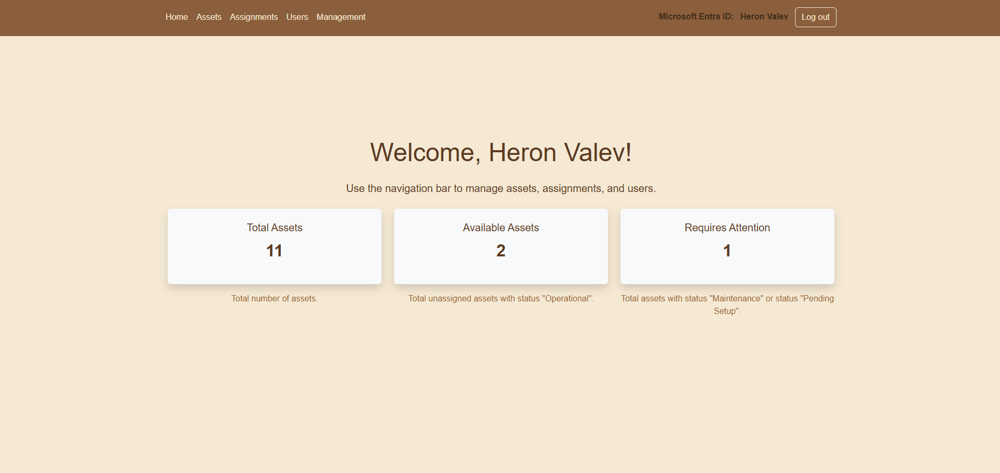
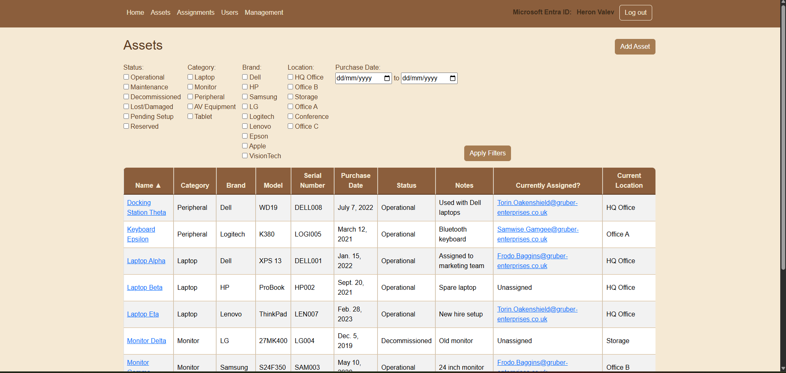
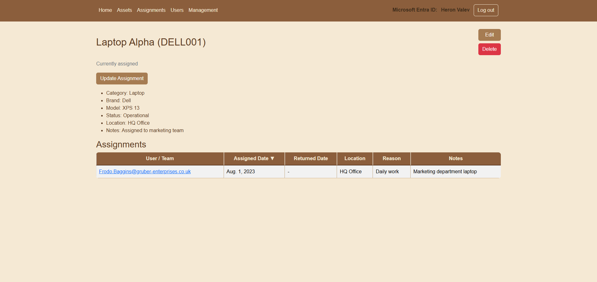
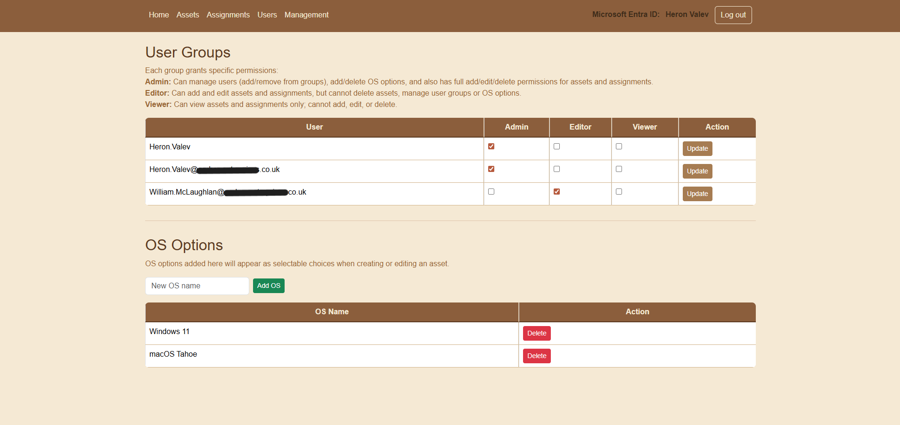

# Assets Manager

A Django web app for tracking company assets (devices/equipment), recording assignments, and integrating with Microsoft Entra ID for SSO. Includes an optional management command to sync Entra users into a local database table via Microsoft Graph.

---

## Features

### Assets
- Create, view, edit, and delete assets (permission-controlled)
- Track asset metadata: category, brand, model, OS, serial number, purchase date, status, location, notes
- Asset status choices:
  - Operational
  - Maintenance
  - Decommissioned
  - Lost/Damaged
  - Pending Setup
  - Reserved
- Asset list page supports filtering and sorting:
  - Filter by status/category/brand/location and purchase date range
  - Sort by multiple columns
- Asset details show assignment history and whether the asset is currently assigned

### Assignments
- Create and edit assignments (permission-controlled)
- Keeps a history of assignments with assigned/returned dates, location, reason, notes
- When an assignment is closed (a returned date is set), the related asset is automatically moved into **Maintenance** status (see `Assignment.save()`)

### Entra users (optional sync)
- `EntraUser` model stores directory user details (UPN, display name, department, active flag)
- Sync command pulls users from Microsoft Graph and upserts into the local DB
- Users missing from Graph are soft-deleted (sets `deleted_at` and marks inactive)

### Role groups
A migration creates three Django auth groups (permissions are configured in Django admin):
- **Admin**: manage users/groups, OS options, and full asset/assignment permissions
- **Editor**: add/edit assets and assignments
- **Viewer**: view assets and assignments only

(Actual access is enforced using Django permissions in the views/templates.)

---

## Tech stack

- **Backend:** Python + Django 5.2.x
- **Database:** SQLite (local development)
- **Authentication:** Microsoft Entra ID SSO (MSAL confidential client)
- **Directory sync (optional):** Microsoft Graph API via `azure-identity` (client credentials) + `requests`
- **Frontend:** Django templates + Bootstrap (CDN) + a small custom stylesheet

---

## Project structure

- `assets_manager/` — Django project settings (`settings.py`, `urls.py`, `wsgi.py`, `asgi.py`)
- `inventory/` — main app (models, views, forms, admin)
  - `inventory/templates/` — templates (`base.html`, `login_error.html`)
  - `inventory/templates/inventory/` — page templates (assets, assignments, users, management)
  - `inventory/static/inventory/` — static files (CSS)
  - `inventory/management/commands/sync_entra_users.py` — sync Entra users from Microsoft Graph
  - `inventory/migrations/` — database migrations
- `db.sqlite3` — local SQLite database (not committed)
- `.env` — local environment variables (not committed)

---

## Microsoft Entra ID setup (required for login)

To run this project, you need your own Microsoft Entra ID tenant and an App Registration. Cloning this repo will not work with someone else’s tenant credentials.

1) Create an App Registration
- Microsoft Entra ID → App registrations → New registration
- Supported account types: typically “Accounts in this organizational directory only” (single-tenant)
- Redirect URI (Platform: Web):
  - `http://localhost:8000/callback/`

2) Create a client secret
- App registration → Certificates & secrets → New client secret
- Copy the secret value

3) Add environment variables
Create a `.env` file in the project root and set:

- `CLIENT_ID` = Application (client) ID
- `TENANT_ID` = Directory (tenant) ID
- `CLIENT_SECRET` = client secret value

4) Log in
- Visit `/login/` to start SSO
- Microsoft redirects back to `/callback/`
- The app creates (or reuses) a Django `User` based on your Entra email/UPN and logs you in

Note: redirect URLs in this project are currently configured for localhost development (`http://localhost:8000`).

---

## Setup (local)

1) Create and activate a virtual environment

Windows (PowerShell):

```powershell
python -m venv .venv
.\.venv\Scripts\Activate.ps1
```

macOS/Linux:

```bash
python -m venv .venv
source .venv/bin/activate
```

2) Install dependencies

```bash
pip install -r requirements.txt
```

3) Create a `.env` file in the project root (`assets-manager/.env`)

```env
CLIENT_ID=your_entra_app_client_id
TENANT_ID=your_entra_tenant_id
CLIENT_SECRET=your_entra_app_client_secret
```

4) Run migrations and start the server

```bash
python manage.py migrate
python manage.py runserver
```

Open:
- http://localhost:8000

---

## Bootstrap admin (first-time setup)

On a fresh clone, Microsoft Entra login will create a normal Django user (no groups by default). To manage group membership and permissions you should bootstrap an admin account first.

Note: `createsuperuser` creates a local Django admin account. This is separate from your Microsoft Entra SSO user.

1) Create a Django superuser

```bash
python manage.py createsuperuser
```

2) Log into the Django admin

- http://localhost:8000/admin/

3) Create and configure groups (one-time)

This project creates three groups via migration:
- Admin
- Editor
- Viewer

In Django admin:
- Go to **Groups**
- Assign the appropriate permissions to each group (e.g. `inventory` add/change/delete where relevant, and `auth.change_user` for Management access)
- Add users to groups as needed

Note: Once your Entra-created user has the correct group/permissions, you can stop using the superuser account for daily access.

---

## Microsoft Graph user sync (optional)

This project includes a management command to sync Entra users into the local `EntraUser` table:

```bash
python manage.py sync_entra_users
```

What it does:
- Calls Microsoft Graph `/users` and stores: `id`, `displayName`, `userPrincipalName`, `department`, `accountEnabled`
- Updates or inserts users into `EntraUser`
- Soft-deletes users missing from Graph (sets `deleted_at` and marks `is_active=False`)

Graph permissions (App Registration):
- The sync uses client credentials (`ClientSecretCredential`) and the scope `https://graph.microsoft.com/.default`
- You need Microsoft Graph Application permission `User.Read.All` (admin consent required in most tenants).

---

## Usage

After logging in, use the navigation bar to access:

- **Assets**: view all assets, apply filters, and open an asset to see its details and assignment history
- **Assignments**: view active and historical assignments, filter and sort results
- **Users**: view Entra users stored in the local database (populated via the optional Graph sync)
- **Management** (permission-controlled): manage Django user group membership and OS options

---

## Key behavior notes

- **Current assignment logic:** an asset is considered “assigned” if it has an `Assignment` with `returned_date` = `NULL`.
- **Location source:** if an asset is currently assigned, its “current location” is taken from the active assignment; otherwise it uses the asset’s own `location` field.
- **Auto status change on return:** when an assignment is closed (a `returned_date` is set), the related asset is automatically moved into **Maintenance** status (see `Assignment.save()`).
- **Soft delete for users:** Entra users missing from Microsoft Graph during sync are not removed from the DB; they are marked inactive and stamped with `deleted_at`.

---

## Deployment notes (Azure App Service)

If you deploy this project to Azure App Service (or similar):

- Set `DEBUG=False` and configure `ALLOWED_HOSTS`
- Use a production database (e.g. Azure Database for PostgreSQL / MySQL) instead of SQLite
- Store `CLIENT_ID`, `TENANT_ID`, and `CLIENT_SECRET` as App Service environment variables
- Update your Entra App Registration to include a production Redirect URI:
  - `https://<your-domain>/callback/`
- Update `MICROSOFT_REDIRECT_URI` and the logout `post_logout_redirect_uri` to use your production domain instead of `http://localhost:8000`

---

## Screenshots

### Home


### Assets


### Asset details


### Management


---

## License

This project is licensed under the MIT License. See `LICENSE` for details.
